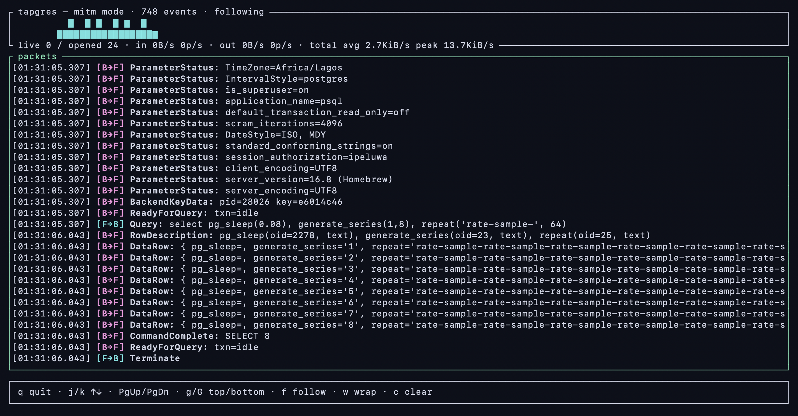

# tapgres

Tap a local PostgreSQL connection and decode its wire traffic.

`tapgres` reassembles each connection and decodes it with the
[`pgwire`](https://crates.io/crates/pgwire) protocol layer. It has two traffic
sources, selected with `--mode`, and an optional interactive view with `--tui`:

- **`pcap`** (default): passively captures traffic on a port with libpcap.
  Cleartext only — if SSL/GSS is negotiated and accepted the stream goes opaque
  and decoding stops. A refused negotiation keeps decoding in cleartext.
- **`mitm`**: runs a local TLS-terminating proxy so you can decode **encrypted**
  sessions too. Point your client at the proxy; it decrypts the client leg,
  decodes in the middle, and forwards to the real server.
- **`--tui`**: render either source as an interactive, scrollable
  full-screen view instead of line-oriented stdout.

`F→B` is the client (frontend) → server (backend); `B→F` is the reverse.

## pcap mode (default)

```
=== new connection  127.0.0.1:40005 -> 127.0.0.1:55432 (port 55432) ===
[F→B] SSLRequest: (awaiting server reply)
[B→F] SslResponse: refuse (continuing in cleartext)
[F→B] Startup: protocol 3.0  user=pgtest, database=postgres
[F→B] Query: SELECT id, name FROM users
[B→F] RowDescription: id(oid=23, text), name(oid=25, text)
[B→F] DataRow: { id=1, name='alice' }
[B→F] CommandComplete: SELECT 1
[B→F] ReadyForQuery: txn=idle
```

```
tapgres -p 5432                 # monitor port 5432 on loopback (default)
tapgres -p 5432 -i eth0         # capture on a specific interface
tapgres -p 5432 -i any          # capture on all interfaces
```

Capturing requires privileges (`CAP_NET_RAW` or root):

```sh
sudo setcap cap_net_raw+ep $(which tapgres)
```

## mitm mode (`--mode mitm`)

The proxy terminates TLS on the **client** leg and re-encrypts (or goes
cleartext) on the **upstream** leg. The decoded output is identical to pcap
mode, but it works against clients that require SSL (`sslmode=require`).

```
            TLS (client trusts tapgres CA)        TLS or cleartext
  psql  ───────────────────────────────►  tapgres  ──────────────────►  postgres
                                          ▲ decodes here ▲
```

1. Start the proxy against your server:

   ```
   tapgres --mode mitm --listen 127.0.0.1:15432 --upstream 127.0.0.1:5432
   ```

   On first run it generates a CA + server certificate (under
   `$XDG_CONFIG_HOME/tapgres`, or `~/.config/tapgres`) and prints where to find
   the CA. Bring your own cert with `--tls-cert`/`--tls-key` if you prefer.

2. Make the client trust the CA and point it at the proxy. For libpq/psql:

   ```sh
   cp ~/.config/tapgres/ca.crt ~/.postgresql/root.crt
   psql "host=127.0.0.1 port=15432 user=… sslmode=require sslrootcert=~/.postgresql/root.crt"
   ```

   The auto-generated leaf is valid for `localhost`, `127.0.0.1` and `::1`.

The upstream leg auto-negotiates TLS (it sends an `SSLRequest` and honors the
server's reply), so it works whether the server is cleartext or TLS. Pass
`--no-upstream-tls` to force a cleartext upstream. The proxy does **not** verify
the upstream certificate — it assumes a local, operator-controlled server.

> GSS encryption is refused (the client falls back); cancel requests are
> relayed verbatim.

## Interactive TUI (`--tui`)



Add `--tui` to either mode for a full-screen, scrollable view instead of
line-oriented stdout. The chosen source runs in a background thread and feeds
the TUI on the main thread:

```
tapgres --tui                              # pcap source, interactive view
tapgres --mode mitm --tui                  # TLS proxy source, interactive view
```

Keybindings:

| Key | Action |
| --- | ------ |
| `q` / `Ctrl-C` | quit |
| `j`/`k`, arrows, `PgUp`/`PgDn` | scroll |
| `g` / `G` | top / bottom |
| `f` | toggle follow (auto-tail) |
| `w` | toggle line wrap |
| `c` | clear |

The direction symbol is highlighted in a high-contrast colour (`[F→B]` cyan,
`[B→F]` magenta) and the packet name is bold; warnings are red and connection
notices yellow. The metrics header shows active and total connections,
cumulative in/out bytes and packet counts with current byte rates, and
60-second packets-per-second sparklines (in cyan, out magenta).
Closed connection records and their final counters are retained for future
filtering (10,000 by default). Tune these bounds with `--conn-history` and
`--rate-history`. Message and byte counts are pgwire messages decoded from the
stream (not TCP segments or socket reads), so they are consistent across the
pcap and mitm sources; bytes that never form a complete message, and anything
after SSL/GSS is accepted, are not counted.
The packet view has a green border. `--tui` with `pcap` still needs capture
privileges.

## Installation

### Prebuilt binary (GitHub Releases)

Each tagged release publishes a Linux x86_64 binary built by the
[release workflow](.github/workflows/release.yml). Download it from the
[releases page](https://github.com/sunng87/tapgres/releases):

```sh
curl -L -o tapgres https://github.com/sunng87/tapgres/releases/latest/download/tapgres-linux-x86_64
chmod +x tapgres
sudo mv tapgres /usr/local/bin/
```

The binary is built with Nix, so on a non-Nix Linux it needs `libpcap.so.1`
reachable via the library path (`libpcap` from your distro). On Arch this is
taken care of by the package below.

### Arch Linux (AUR)

```sh
paru -S tapgres-bin        # or: yay -S tapgres-bin
tapgres --help
```

`tapgres-bin` wraps the release binary, repoints its ELF interpreter to the
system loader, and depends on `libpcap`.

### Nix (flake)

Run once, without installing:

```sh
nix run github:sunng87/tapgres -- --help
```

Install into your user profile:

```sh
nix profile install github:sunng87/tapgres
```

Or build locally and run the result:

```sh
nix build && ./result/bin/tapgres --help
```

To consume it from another flake, add it to your inputs and reference
`tapgres.packages.${system}.default`.

### Build from source (Cargo)

libpcap must be installed (e.g. `libpcap-dev` on Debian/Ubuntu,
`libpcap` on Arch/Homebrew):

```sh
cargo install --path .
```

## Develop

```sh
nix develop   # Rust toolchain + libpcap + PostgreSQL 18
cargo test
```

## License

MIT. See [LICENSE](LICENSE).
