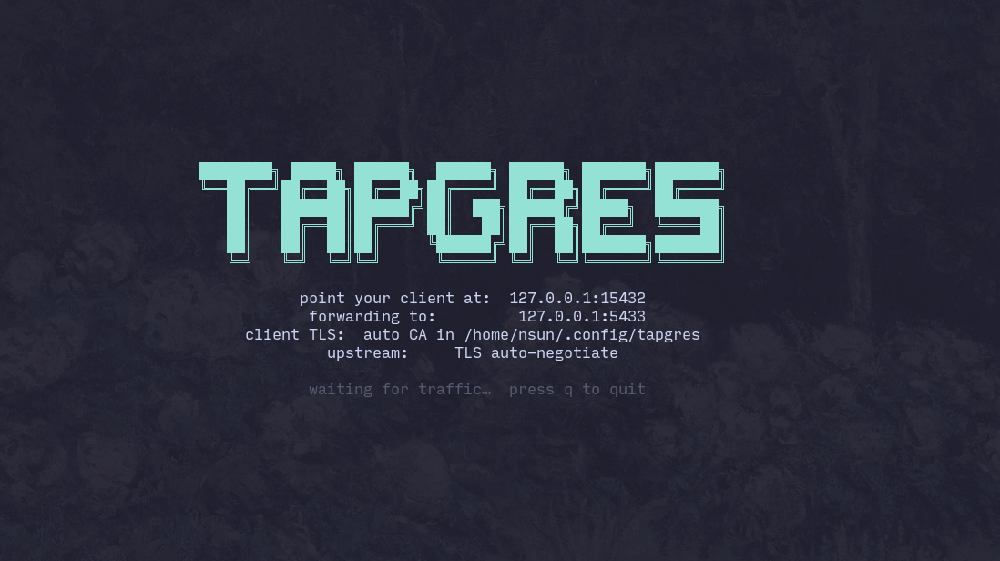
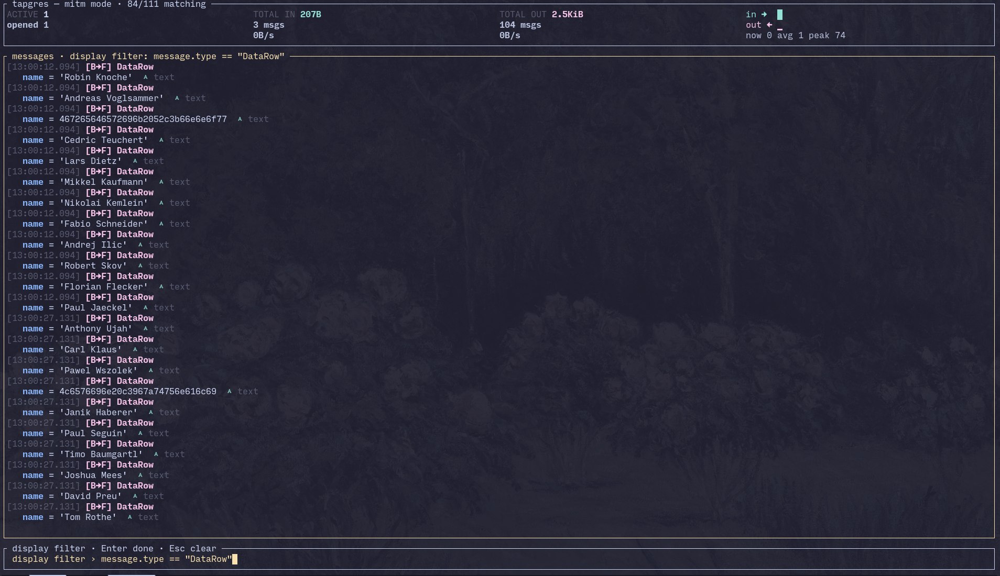

# tapgres

Tap a local PostgreSQL connection and decode its wire traffic.



`tapgres` reassembles each PostgreSQL connection and decodes it with the
[`pgwire`](https://crates.io/crates/pgwire) protocol layer into readable
stdout or an interactive TUI. It has two traffic sources, selected with
`--mode`:

- **`pcap`** (default) — passively captures a local port with libpcap.
  Cleartext only.
- **`mitm`** — a local TLS-terminating proxy, so you can decode **encrypted**
  sessions too. Point your client at it; it decrypts and forwards to the real
  server.

Add `--tui` to either source for a full-screen, scrollable, filterable view.
Display filters, live connection metrics, and a Wireshark-style `-Y` filter
work across both.

## Quick start

```sh
tapgres                                  # monitor loopback :5432 (the defaults)
tapgres -p 5432 -i eth0                  # capture a specific interface
tapgres --mode mitm \                    # decode an encrypted session via the proxy
  --listen 127.0.0.1:15432 --upstream 127.0.0.1:5432
tapgres --tui -Y 'message.type == "Query"'   # interactive view, filtered
```

For making a client trust the mitm proxy's auto-generated CA, see
`man tapgres`. A sample of the decoded output (`F→B` is client→server,
`B→F` the reverse):

```
[F→B] Query: SELECT id, name FROM users
[B→F] RowDescription: id(oid=23), name(oid=25)
[B→F] DataRow: { id=1, name='alice' }
[B→F] ReadyForQuery: txn=idle
```

pcap mode needs capture privileges — grant them once instead of running as
root:

```sh
sudo setcap cap_net_raw+ep $(which tapgres)
```

## Interactive TUI (`--tui`)



| Key | Action |
| --- | ------ |
| `q` / `Ctrl-C` | quit |
| `j`/`k`, arrows, `PgUp`/`PgDn` | scroll |
| `g` / `G` | top / bottom |
| `f` | follow (auto-tail) |
| `w` / `r` | wrap / rich display |
| `c` | clear |
| `y` | edit the display filter |
| `Esc` | clear the display filter |

Display filters (`-Y` / `--display-filter`) use a small typed expression
language with fields like `message.type`, `message.text`, `client.ip`, and
`client.port`. See `man tapgres` for the full field and operator reference.

## Installation

**Prebuilt binary** (Linux x86_64, from
[releases](https://github.com/sunng87/tapgres/releases)):

```sh
curl -L -o tapgres https://github.com/sunng87/tapgres/releases/latest/download/tapgres-linux-x86_64
chmod +x tapgres && sudo mv tapgres /usr/local/bin/
```

Built with Nix; on a non-Nix Linux it needs `libpcap.so.1` on the library path.

**Arch Linux (AUR):**

```sh
paru -S tapgres-bin
```

**Nix (flake):**

```sh
nix run github:sunng87/tapgres -- --help      # try it without installing
nix profile install github:sunng87/tapgres    # or install it
```

**Build from source** (libpcap required — `libpcap-dev` on Debian/Ubuntu):

```sh
cargo install --path .
```

A manual page is included in the Nix and Arch packages (`man tapgres`).

## Develop

```sh
nix develop   # Rust toolchain + libpcap + PostgreSQL 18
cargo test
```

The manpage is generated from the clap CLI definition; rebuild it after any
option change:

```sh
cargo run --example gen_manpage > man/tapgres.1
```

## License

MIT. See [LICENSE](LICENSE).
